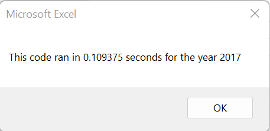
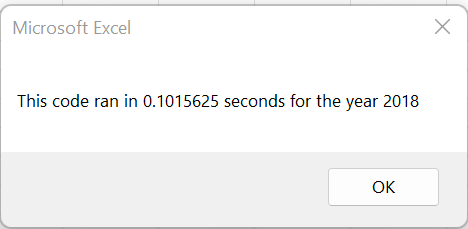
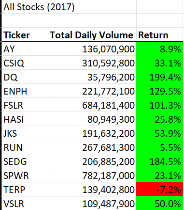
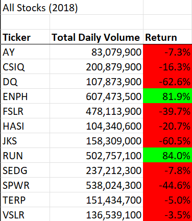

# Refactoring VBA Code and Measuring Performance
Roselyanne Cepero Santos

## Overview of Project
The purpose of this analysis is to demonstrate the ability to refactor Microsoft Visual Basic for Applications (VBA) code and measure performance. 

For this deliverable, the author has already done the following as part of Module 2:
* Create a variable with single or long data types.
* Write for loops.
* Write if-then statements.
* Use design patterns.
* Use logical and comparison operators.
* Use an index to access data in an array.
* Use nested loops.
* Reuse code.
* Debug and comment on code.
* Use visual and numeric formatting.
* Use conditional formatting.
* Measure code performance.

## Results
Below are the images of the stock performance between 2017 and 2018, as well as the execution times of the original script and refactored script.

### Differences in Stock Performance
Explain stock performances in 2017 and 2018.

### Differences in Execution Times
In  2017, the code ran in 0.109375 seconds. In 2018, the code finished in 0.1015625 seconds. The 2018 code was 0.0078125 seconds (7.81255 milliseconds) quicker than the 2017 code. This demonstrates that the refactoring process improved the efficiency and maintainability of the code, as well as its readability and clarity. 

## Summary
Refactoring, which can be thought as revising and maintaining code, is an important technique in order to increase the readability and clarity of the code all the while removing and preventing bugs. Written by IONOS, they stated in *Refactoring: how to improve source code* that: 
> another goal of refactoring is to **improve error analyis and the maintainability** of software. <
Since the 2018 code was quicker than the 2017 code, this demonstrates that the most recent code is formatted in such a manner whereas the there is are little-to-no examples of confusing, excessive codes, as well as no redundances (Hemmelgarn). Refactoring not only can optimize file size but depending upon if 
> 1. there are no existing bugs that would be solved by refactoring the code (Crenshaw "Discussion") [and;] <
> 2. there are also no security-related anti-patterns (Crenshaw "Discussion") [present in the code,] <
then this technique may improve performance. Sometimes however, there are disadvantages in refactoring code if the process becomes too inefficient without a worthwile pay off, such as debugging and optimizing the file size. 

Tie back this concept to the 2017 and 2018 execution times.

## Resources
>https://www.ionos.com/digitalguide/websites/web-development/what-is-refactoring/
>https://dev.to/crenshaw_dev/how-do-you-know-when-to-not-refactor-14d9
